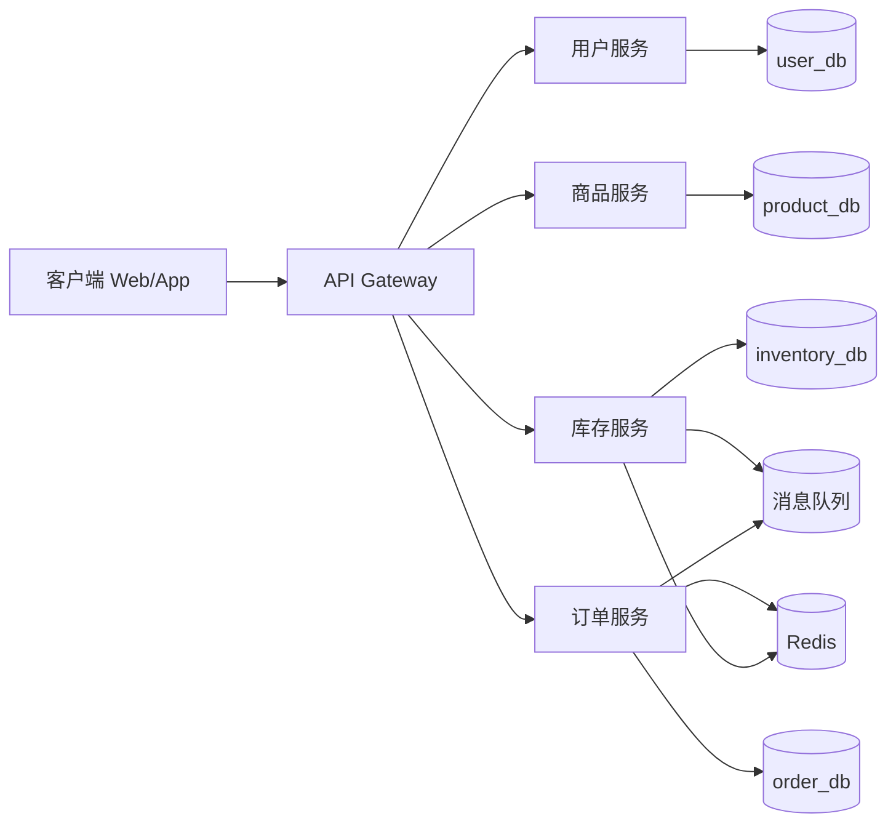
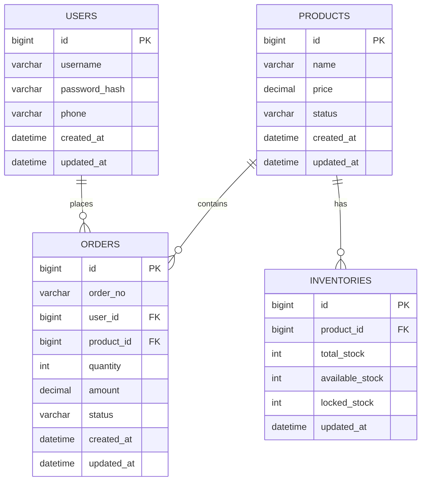

# 商品库存与秒杀系统设计文档

## 1. 系统架构草图

### 1.1 服务拆分
- 用户服务（User Service）: 用户注册、登录、用户信息维护
- 商品服务（Product Service）: 商品信息管理、商品查询
- 库存服务（Inventory Service）: 库存扣减、回补、库存锁定
- 订单服务（Order Service）: 创建订单、订单状态流转、支付回调对接

### 1.2 架构示意图


### 1.3 核心链路（秒杀）
1. 客户端请求秒杀接口。
2. 网关进行限流、鉴权。
3. 库存服务优先在 Redis 预减库存。
4. 预减成功后，订单服务异步创建订单（消息队列削峰）。
5. 订单创建成功后写入订单表并更新状态。

## 2. 服务 API（RESTful）

> 统一前缀示例：`/api/v1`

### 2.1 用户服务
- `POST /api/v1/users/register` 注册
- `POST /api/v1/users/login` 登录
- `GET /api/v1/users/{id}` 查询用户信息

### 2.2 商品服务
- `POST /api/v1/products` 新增商品
- `GET /api/v1/products/{id}` 查询商品详情
- `GET /api/v1/products` 分页查询商品

### 2.3 库存服务
- `GET /api/v1/inventories/{productId}` 查询库存
- `POST /api/v1/inventories/deduct` 扣减库存
- `POST /api/v1/inventories/release` 释放库存

### 2.4 订单服务
- `POST /api/v1/orders` 创建订单
- `GET /api/v1/orders/{id}` 查询订单
- `GET /api/v1/orders` 查询订单列表

### 2.5 关键接口示例
#### 用户注册
- 请求：`POST /api/v1/users/register`
```json
{
  "username": "alice",
  "password": "123456",
  "phone": "13800000000"
}
```
- 响应：
```json
{
  "code": 0,
  "message": "ok",
  "data": {
    "id": 1,
    "username": "alice"
  }
}
```

#### 扣减库存
- 请求：`POST /api/v1/inventories/deduct`
```json
{
  "productId": 1001,
  "quantity": 1,
  "orderNo": "SK202603110001"
}
```

## 3. 数据库 ER 图



## 4. 技术栈选型说明

### 4.1 编程语言
- Java 17

### 4.2 框架
- Spring Boot 3.x：快速构建 REST 服务
- MyBatis：SQL 可控，适合秒杀场景的精细化优化

### 4.3 中间件（初选）
- MySQL 8.0：核心业务数据持久化
- Redis：缓存热点商品与库存，支撑高并发
- RabbitMQ（或 Kafka）：异步下单、削峰填谷
- Nginx：网关层前置与静态资源代理

### 4.4 可观测与治理（后续可加）
- 日志：ELK / Loki
- 监控：Prometheus + Grafana
- 链路追踪：SkyWalking / OpenTelemetry
