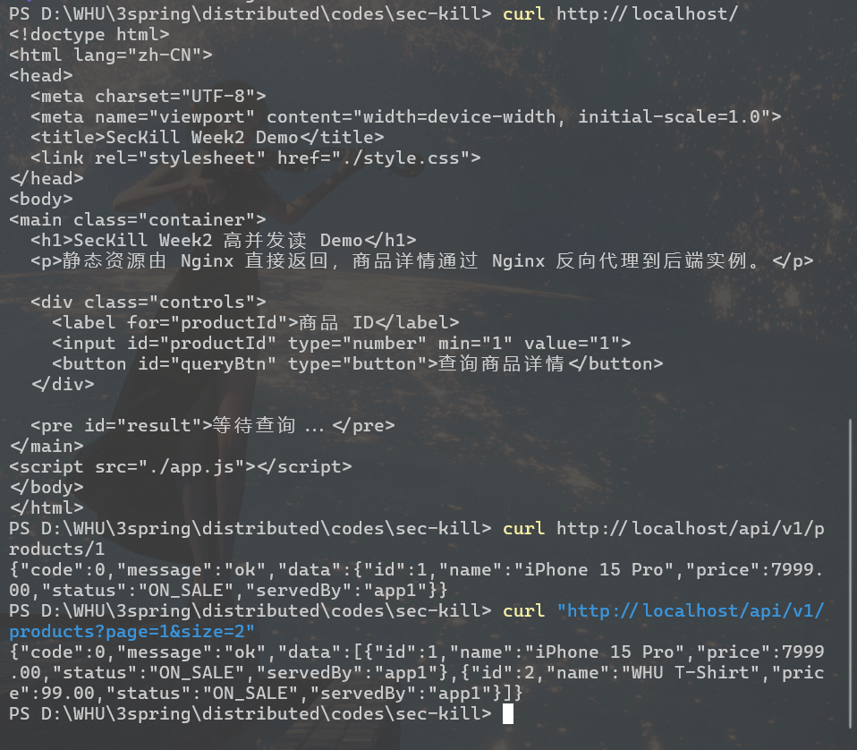
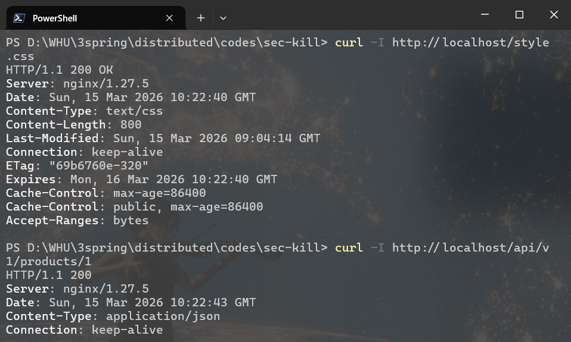
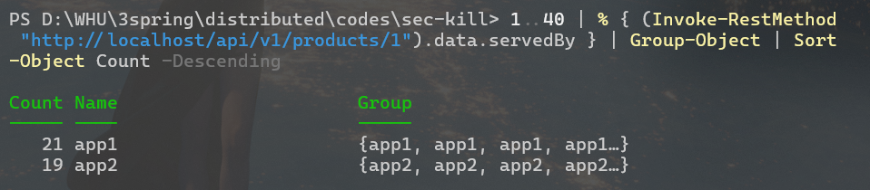
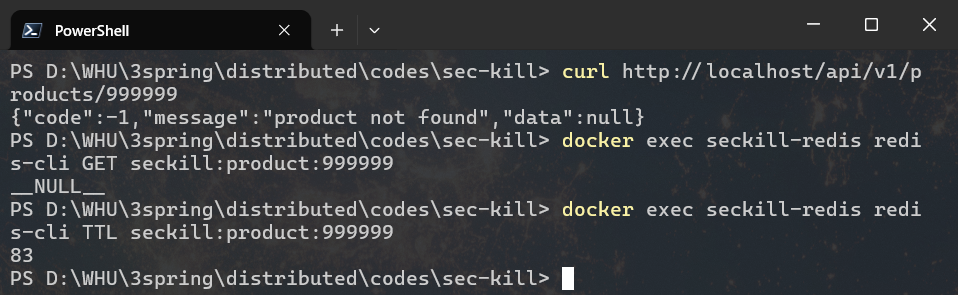
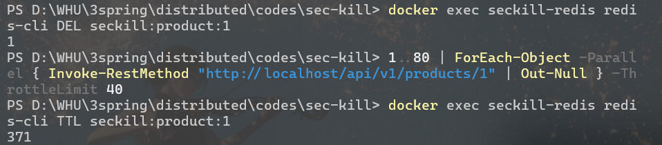
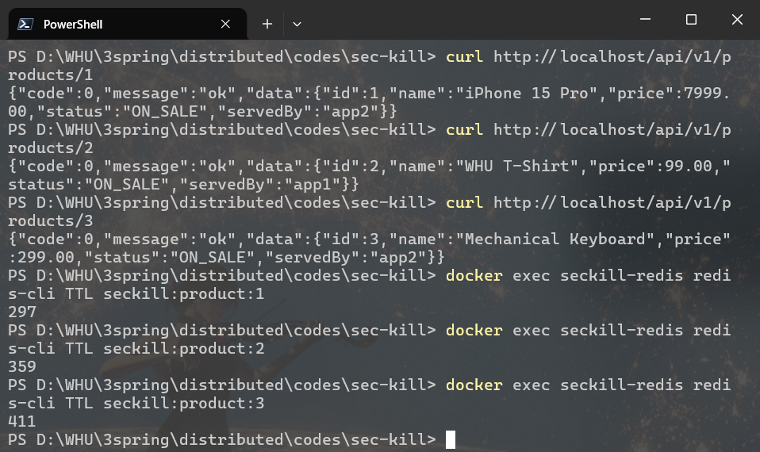
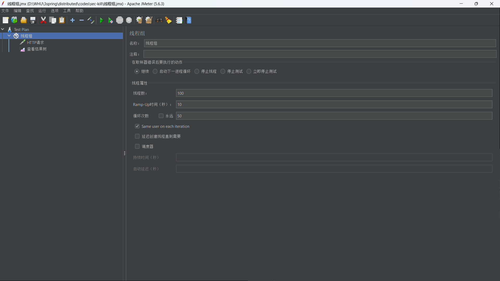
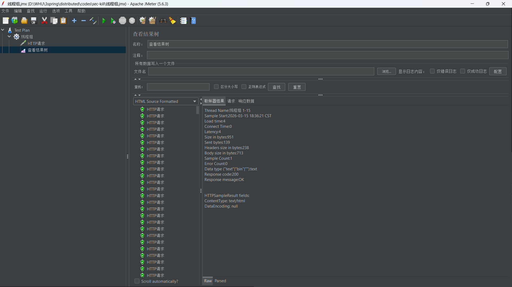

## 1. 基础可用

测试命令：
```
curl http://localhost/
curl http://localhost/api/v1/products/1
curl "http://localhost/api/v1/products?page=1&size=2"
```
测试结果：


## 2. 动静分离

测试命令：
```
curl -I http://localhost/style.css
curl -I http://localhost/api/v1/products/1
```
测试结果：


## 3. 负载均衡分布

测试命令：
```
1..40 | % { (Invoke-RestMethod "http://localhost/api/v1/products/1").data.servedBy } | Group-Object | Sort-Object Count -Descending
```
测试结果：


## 4. 缓存穿透

测试命令：
```
curl http://localhost/api/v1/products/999999
docker exec seckill-redis redis-cli GET seckill:product:999999
docker exec seckill-redis redis-cli TTL seckill:product:999999
```
测试结果：


## 5. 缓存击穿

测试命令：
```
docker exec seckill-redis redis-cli DEL seckill:product:1
1..80 | ForEach-Object -Parallel { Invoke-RestMethod "http://localhost/api/v1/products/1" | Out-Null } -ThrottleLimit 40
docker exec seckill-redis redis-cli TTL seckill:product:1
```
测试结果：


## 6. 缓存雪崩 

测试命令：
```
curl http://localhost/api/v1/products/1
curl http://localhost/api/v1/products/2
curl http://localhost/api/v1/products/3
docker exec seckill-redis redis-cli TTL seckill:product:1
docker exec seckill-redis redis-cli TTL seckill:product:2
docker exec seckill-redis redis-cli TTL seckill:product:3

```
测试结果：


## 7. Jemeter



